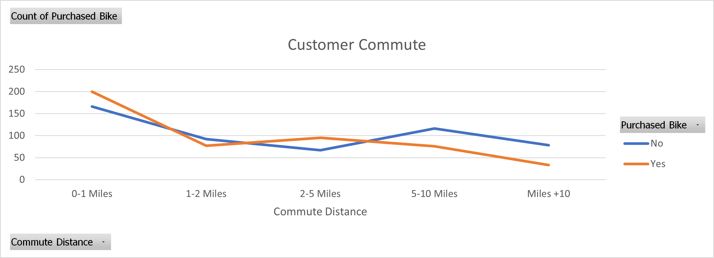
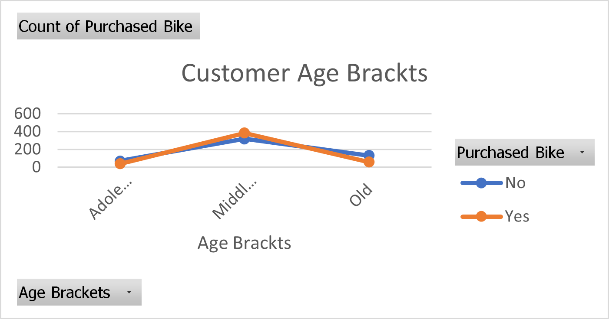
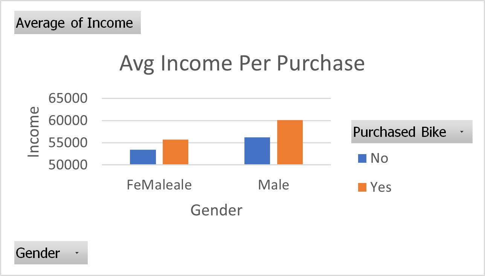

# Project Description

This project focuses on the analysis of bike sales data, aiming to uncover insights into customer demographics, purchasing behavior, and potential market segments. The dataset includes detailed information on income, education, occupation, and more, offering a comprehensive view of the target market for bike sales.

**Key Features**:
-   **Demographic Analysis**: Explore how factors like age, income, and education influence bike purchasing decisions.
-   **Market Segmentation**: Identify key customer segments and tailor marketing strategies accordingly.
-   **Predictive Modeling**: Develop models to predict the likelihood of bike purchases based on demographic factors.
-   **Sales and Product Strategy**: Use insights to refine sales strategies and guide product development.

## Data Walkthrough
The Excel file titled **"Bike Sales"** contains four sheets: `bike_buyers`, `Work Sheet`, `Pivot Table`, and `Dashboard`. Below is a description of the key data and insights from each relevant sheet:

#### 1. **bike_buyers**

-   **Purpose**: Contains raw data on individuals who are potential or actual bike buyers.
-   **Columns**:
    -   **ID**: Unique identifier for each individual.
    -   **Marital Status**: Whether the individual is married or single.
    -   **Gender**: The individual's gender.
    -   **Income**: Annual income in numerical format.
    -   **Children**: Number of children the individual has.
    -   **Education**: Highest educational qualification.
    -   **Occupation**: Job type or profession.
    -   **Home Owner**: Indicates homeownership status.
    -   **Cars**: Number of cars owned.
    -   **Commute Distance**: Distance to commute to work.
    -   **Region**: Geographic region (e.g., Europe, Pacific, North America).
    -   **Age**: Age of the individual.
    -   **Purchased Bike**: Indicates whether the individual purchased a bike.

#### 2. **Work Sheet**

-   **Purpose**: Provides a more detailed view of the bike buyers, including additional information like age brackets.
-   **Additional Columns**:
    -   **Age Brackets**: Categorizes age into groups like Young, Middle Age, and Old.
-   **Use**: This data can be used to analyze demographic patterns and purchasing behavior among different age groups, income levels, and regions.

#### 3. **Pivot Table**

-   **Purpose**: Offers a summarized view of the data with a focus on income and bike purchasing behavior.
-   **Columns**:
    -   **Average of Income**: Shows average income grouped by gender and bike purchase decision.
    -   **Gender (Row Labels)**: Breaks down the data by gender.
    -   **Purchased Bike (Column Labels)**: Compares those who purchased a bike versus those who didn’t.
-   **Use**: This table helps to quickly identify patterns in income across different demographics and their likelihood to purchase a bike.

#### 4. **Dashboard**

-   **Purpose**: This sheet is currently empty, but it is intended to serve as a space for visualizations and summaries based on the data.
-   **Use**: Could be used to create dashboards in Excel or other BI tools to visualize key insights from the data.
    
## Some Insights from the Analysis
Here are some Photos from the analysis :

